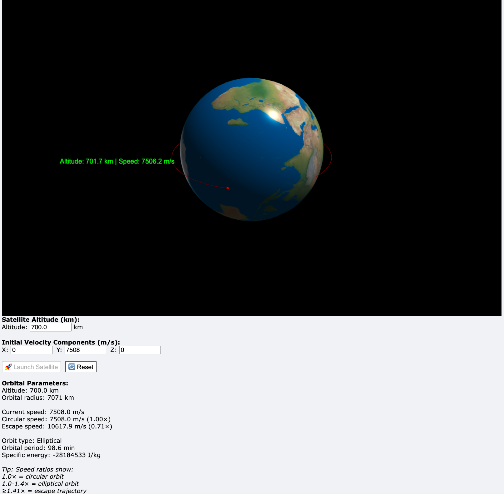

# Satellite-Orbit-Simulation
This Python program is an interactive 3D satellite orbit simulation built with VPython. It models orbital mechanics using gravitational physics and provides real-time visualization of a satellite’s trajectory around Earth. Users can input parameters such as altitude and velocity components, and the program dynamically updates the satellite’s position, velocity vectors, and orbital characteristics. The interface displays key orbital data, including altitude, speed, orbital type, period, and energy, while visual elements such as velocity arrows and trails enhance understanding of motion. The simulation supports launching and resetting the satellite, recalculating circular and escape velocities, and detecting collisions with Earth, which trigger an animated explosion. The main loop continuously applies gravitational acceleration to update the satellite’s motion based on Newtonian mechanics, creating an educational and visually engaging tool for learning orbital dynamics.

